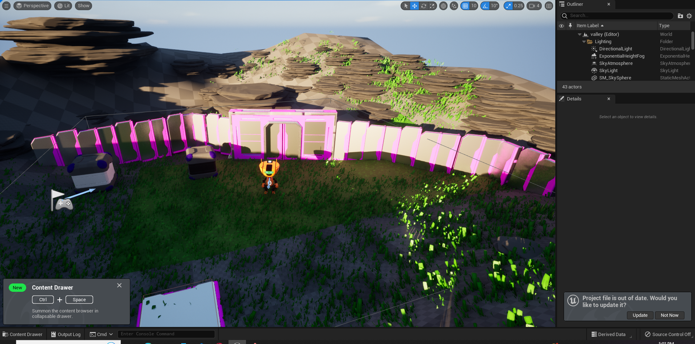
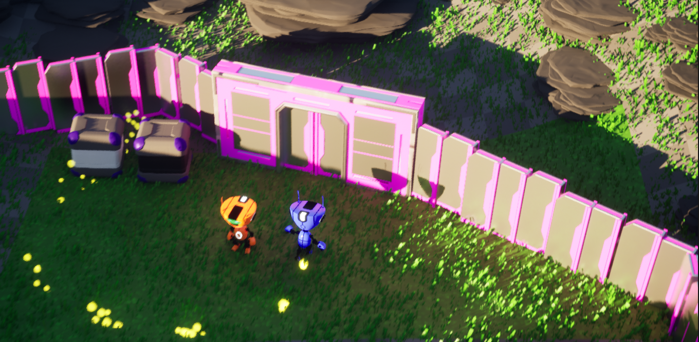
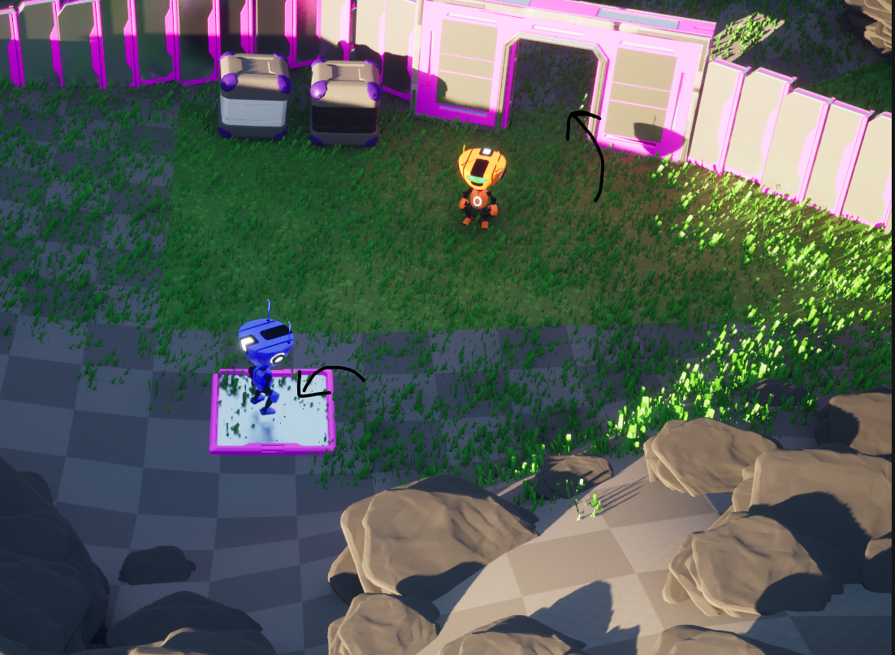
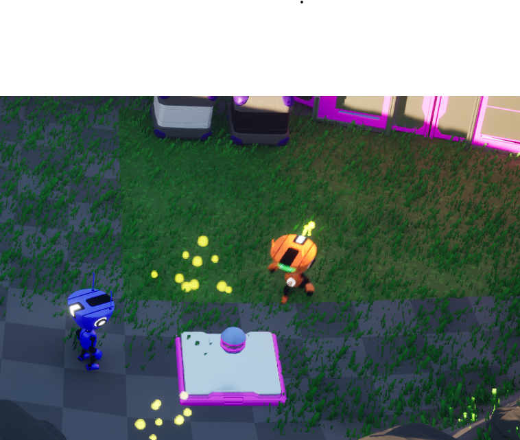
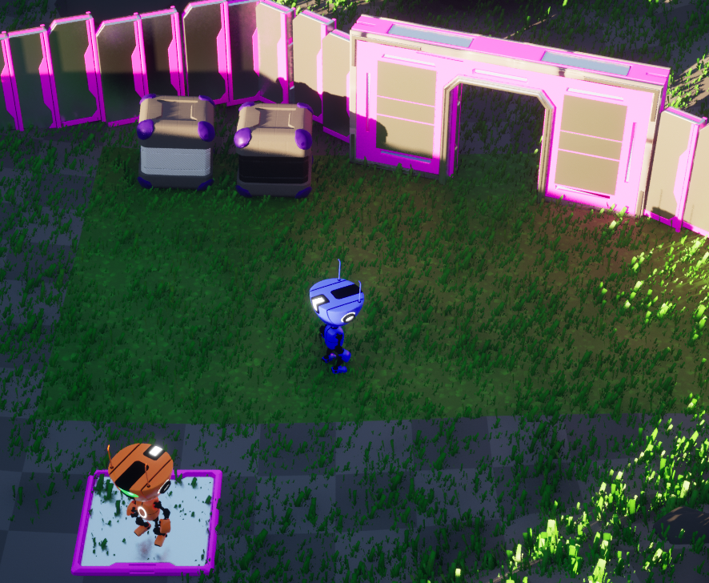

<body>
    <h1>Unreal_Engine_RobotGame</h1>

  ## Table of Contents
* [General Info](#general-information)
* [Technologies Used](#technologies-used)
* [Screenshots](#screenshots)
* [Project Status](#project-status)
* [Contact](#contact)

  ## General Information
- simple template game using blueprint and unreal engine ,Develop my creativity, 😁
  
  ## Technologies Used
* Unreal engine 5.0
* blueprint

  
  ## Screenshots
  
  
  
  
  
   
   ## Project Status
   complete
   
   ## Contact
Created by <a href="https://github.com/NourNabil2">Nour Nabil</a> - feel free to contact me!
    
</body>
